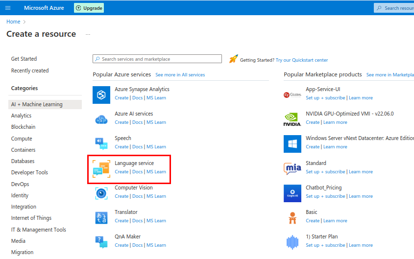
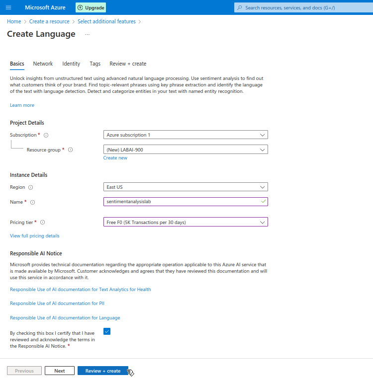
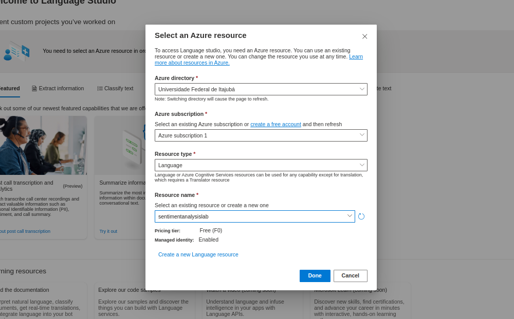
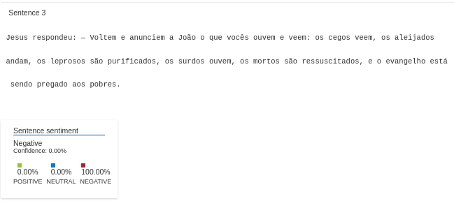
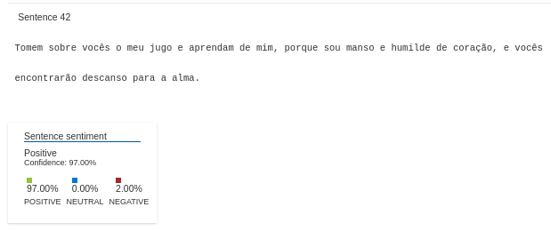

# 💻 Lab Project 03 - Análise de Sentimentos com Language Studio no Azure AI

A funcionalidade de **análise de sentimentos e mineração de opiniões** faz parte da plataforma **Language Studio do Azure**, permitindo **identificar sentimentos positivos, negativos ou neutros** em sentenças. Este repositório apresenta exemplos práticos de testes realizados na plataforma, como parte do **Bootcamp Microsoft Azure AI Fundamentals promovido pela DIO**.

---

## 📑 Índice

1. [🛠️ Procedimento](#️procedimento)
2. [📊 Resultados](#resultados)
3. [💡 Conclusão e Insights](#conclusão-e-insights)

---

## 🛠️ Procedimento

Os testes seguiram instruções do Microsoft Learn. Para mais detalhes, consulte:

🔗 [Analyze text with Language Studio](https://microsoftlearning.github.io/mslearn-ai-fundamentals/Instructions/Labs/06-text-analysis.html)

### 1. Criando o recurso **Azure Language Service**

1. Acesse o portal: https://portal.azure.com  
2. Clique em **"Create a resource"** e selecione **Language Service**.

    

    

3. Aguarde o término do *deploy*.

---

### 2. Conectando ao **Language Studio**

1. Acesse o [🌐 Language Studio](https://language.cognitive.azure.com/home).  
2. Na página inicial, clique em **"Select a resource"**.

    

3. Preencha os dados e selecione o recurso criado.

    

---

### 3. Usando o serviço de análise de sentimentos

Na aba **"Classify text"**, selecione o serviço **"Analyze sentiment and mine opinions"**:

    

---

## 📊 Resultados

Com o recurso ativo, é possível:

- Carregar um texto para análise
- Definir o idioma
- Ativar a opção de *opinion mining*

Para este experimento, foi utilizado um trecho do livro de Mateus (Bíblia).

    

O sistema indicou que **65% do conteúdo apresenta sentimento negativo**, com apenas **25% de confiança geral**.

    

 

    

 

    

Também foi possível visualizar o funcionamento da **mineração de opiniões** (*opinion mining*):

    

---

## 💡 Conclusão e Insights

Ferramentas de **análise de sentimentos** são extremamente úteis na **automação de análises textuais**, como avaliações e *feedbacks*.

⚠️ Porém, os resultados indicam que o sistema pode ter limitações em textos **menos diretos** ou com **contexto complexo**, possivelmente por realizar a análise **sentença por sentença**, sem entender o **contexto global**.

🔍 Uma abordagem baseada em **compreensão contextual ampla** e **relação entre sentenças** poderia oferecer resultados mais coerentes em textos narrativos ou informativos.

---
